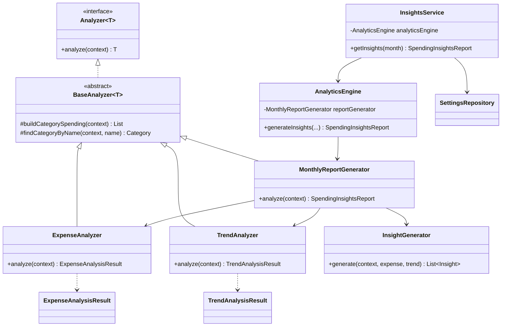

# Smart Expense Tracker — Architecture Guide

## Folder Structure

```
com.expensetracker/
├── Main.java                    # Entry point (web server or console)
├── AppContext.java              # Dependency wiring (composition root)
│
├── model/                       # Domain entities
│   ├── Expense, Category, Budget
│   ├── Insight, InsightType, InsightSeverity
│   ├── CategorySpending, MonthlyTrendPoint
│   ├── SpendingInsightsReport
│   └── UserSettings
│
├── repository/                  # Data access (file handling)
│   ├── ExpenseRepository
│   ├── CategoryRepository
│   ├── BudgetRepository
│   └── SettingsRepository
│
├── service/                     # Business logic layer
│   ├── ExpenseService
│   ├── CategoryService
│   ├── BudgetService
│   ├── ReportService
│   └── InsightsService          # Orchestrates analytics engine
│
├── analytics/                   # Smart Spending Insights engine
│   ├── Analyzer.java            # Interface (abstraction)
│   ├── BaseAnalyzer.java        # Abstract base (inheritance)
│   ├── AnalysisContext.java     # Shared analysis data
│   ├── ExpenseAnalyzer.java     # Category & total analysis
│   ├── TrendAnalyzer.java       # Multi-month trends
│   ├── InsightGenerator.java    # Recommendation rules
│   ├── MonthlyReportGenerator.java  # Final report assembly
│   ├── AnalyticsEngine.java     # Facade coordinating analyzers
│   ├── ExpenseAnalysisResult.java
│   └── TrendAnalysisResult.java
│
├── utils/                       # Helpers
│   ├── CurrencyUtil.java
│   └── PercentageUtil.java
│
├── storage/                     # JSON persistence
│   ├── JsonFileStorage.java
│   ├── LocalDateAdapter.java
│   └── YearMonthAdapter.java
│
├── web/                         # HTTP server & REST API
│   ├── WebServer.java
│   ├── ApiHandler.java
│   ├── StaticFileHandler.java
│   └── JsonUtil.java
│
└── ui/                          # Console interface
    └── ConsoleApp.java

src/main/resources/web/          # Frontend (HTML, CSS, JS)
├── index.html
├── css/style.css
└── js/app.js
```

---

## Class Diagram (UML)



---

## Class Responsibilities

| Class | Responsibility |
|-------|----------------|
| **Analyzer&lt;T&gt;** | Interface defining the contract for all analyzers (abstraction) |
| **BaseAnalyzer&lt;T&gt;** | Shared helper methods for category spending calculations (inheritance) |
| **ExpenseAnalyzer** | Computes totals, per-category spending, highest/lowest/fastest-growing |
| **TrendAnalyzer** | Builds 6-month trend data and detects consecutive month increases |
| **InsightGenerator** | Applies business rules to produce human-readable recommendations |
| **MonthlyReportGenerator** | Assembles all analysis into `SpendingInsightsReport` |
| **AnalyticsEngine** | Facade that wires repositories into `AnalysisContext` and runs analysis |
| **InsightsService** | Service layer entry point; loads user income from settings |
| **SettingsRepository** | Persists monthly income and user name to `settings.json` |

---

## Data Flow

```
Browser (app.js)
    │
    ▼ GET /api/insights?month=2026-06
ApiHandler
    │
    ▼
InsightsService.getInsights(month)
    │
    ▼
AnalyticsEngine.generateInsights(...)
    │
    ├── Creates AnalysisContext (month, income, repositories)
    │
    ▼
MonthlyReportGenerator.analyze(context)
    │
    ├── ExpenseAnalyzer.analyze()     → totals, categories
    ├── TrendAnalyzer.analyze()       → 6-month chart, streaks
    ├── InsightGenerator.generate()   → personalized tips
    └── Builds SpendingInsightsReport + summary
    │
    ▼
JSON response → Dashboard renders insights panel
```

---

## OOP Concepts Used

| Concept | Where |
|---------|-------|
| **Encapsulation** | `AnalysisContext` hides repository access; model classes use private fields |
| **Inheritance** | `ExpenseAnalyzer`, `TrendAnalyzer`, `MonthlyReportGenerator` extend `BaseAnalyzer` |
| **Polymorphism** | All analyzers implement `Analyzer<T>`; interchangeable via interface |
| **Abstraction** | `Analyzer<T>` interface; `AnalyticsEngine` facade hides complexity |
| **Composition** | `MonthlyReportGenerator` composes `ExpenseAnalyzer`, `TrendAnalyzer`, `InsightGenerator` |
| **Collections** | `ArrayList`, `HashMap`, `stream()` for filtering and sorting insights |
| **File Handling** | JSON repositories persist expenses, budgets, categories, settings |
| **Exception Handling** | `IllegalArgumentException` in services; HTTP error responses in `ApiHandler` |

---

## Analytics Logic

### Spending Trends
- Compares current month total vs previous month
- Per-category % change when previous month > 0

### Category Analysis
- **Highest**: max `currentMonth` spend
- **Lowest**: min non-zero spend
- **Fastest growing**: max % increase where previous > 0

### Budget Analysis
- Flags categories where spent > limit
- Warns when utilization ≥ 80%
- Overall budget utilization = total spent on budgeted categories / total limits

### Savings Recommendations
- Food delivery: detects "swiggy", "zomato", "delivery" in descriptions → 20% reduction tip
- General food: 15% reduction estimate if no delivery detected
- Aggregates potential monthly savings

### Consecutive Trends
- Counts months where category spending increased month-over-month
- Warns at 2+ months; strong warning at 3+ months

### Income Insights
- When monthly income is set in settings: flags categories consuming ≥ 30% of income

---

## Dashboard Wireframe

```
┌─────────────────────────────────────────────────────────┐
│  👤 Good evening, Kaif          [Month ▼]  [⚙]         │
├─────────────────────────────────────────────────────────┤
│ [Dashboard] [Expenses] [Categories] [Budgets]           │
├─────────────────────────────────────────────────────────┤
│ 💡 Smart Spending Insights                              │
│ • Food expenses increased by 25% this month.            │
│ • Entertainment budget exceeded by ₹1,500.              │
│ 💰 Potential monthly savings: ₹3,200                    │
├──────────────┬──────────────┬───────────────────────────┤
│ Total ₹45,200│ Budget ₹50k  │ Transactions: 23          │
├──────────────┴──────────────┴───────────────────────────┤
│ Category Breakdown    │ Spending Trends (bar chart)      │
├───────────────────────┴──────────────────────────────────┤
│ Monthly Report — narrative summary + highlight chips      │
├─────────────────────────────────────────────────────────┤
│ Recent Transactions (last 5)                              │
└─────────────────────────────────────────────────────────┘
```

---

## API Endpoints

| Method | Path | Description |
|--------|------|-------------|
| GET | `/api/insights?month=yyyy-MM` | Full insights report |
| GET | `/api/settings` | User name & monthly income |
| PUT | `/api/settings` | Update `{ userName, monthlyIncome }` |

---

## Implementation Roadmap

1. ✅ Model layer — `Insight`, `SpendingInsightsReport`
2. ✅ Analytics engine — analyzers with OOP hierarchy
3. ✅ `InsightsService` + settings repository
4. ✅ REST API `/api/insights`
5. ✅ Premium fintech dashboard UI
6. 🔲 Unit tests for `InsightGenerator` rules
7. 🔲 Export insights as PDF/text report
8. 🔲 Weekly spending alerts

---

## Step-by-Step Development Guide

### Step 1: Run the project
```bat
compile.bat
run.bat
```
Open http://localhost:8080

### Step 2: Set your profile
Click ⚙ → enter name and monthly income → Save

### Step 3: Add expenses
Use the Expenses tab. Include keywords like "Swiggy delivery" for food delivery insights.

### Step 4: Set budgets
Use the Budgets tab to set monthly limits per category.

### Step 5: View insights
Return to Dashboard — the **Smart Spending Insights** panel updates automatically.

### Step 6: Explore trends
The spending trends chart shows the last 6 months. Change the month picker to analyze past periods.

---

## Beginner Tips

- Start with `ExpenseAnalyzer.java` to understand how totals are computed
- Read `InsightGenerator.java` to see how plain English messages are built
- The `Analyzer<T>` interface is the key polymorphism pattern — each analyzer returns a different type
- All data is stored in `%USERPROFILE%\.smart-expense-tracker\`
